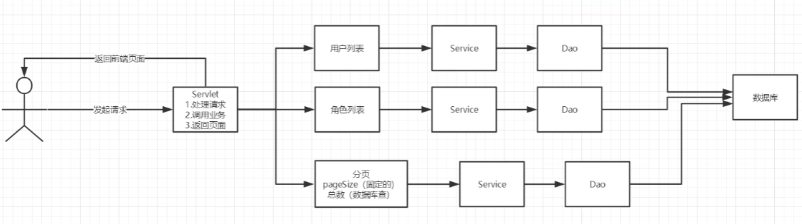
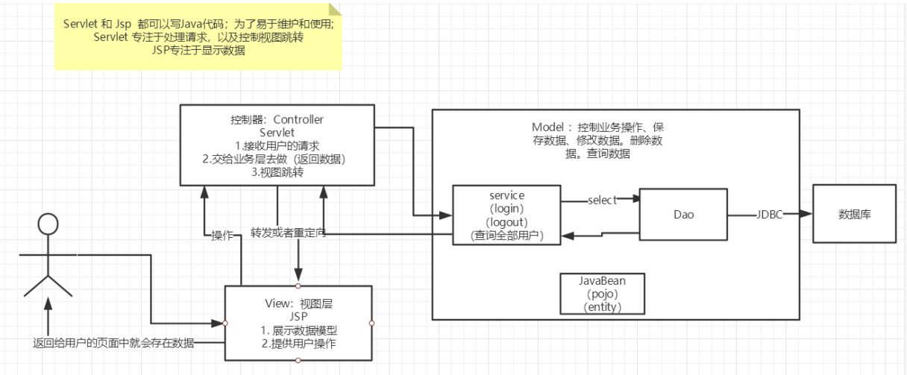
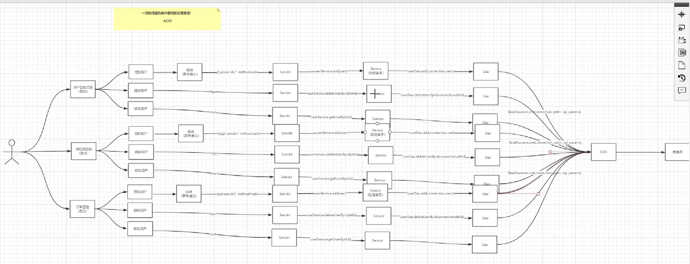

# JavaWeb Project Study
### 来源：https://www.bilibili.com/video/BV12J411M7Sj
## 登录功能

- 登录--->接收用户的登录请求--->处理用户的请求（获取用户登录的参数，username，
  password）---->交给业务层处理登录业务（判断用户名密码是否正确：事务）--->Dao层查询用
  户名和密码是否正确-->数据库
  
## 用户管理
### 思路

#### 1. 导入分页工具类
#### 2. 用户列表页面导入
### MVC框架

- Model
    -   业务处理：业务逻辑（Service）
    -   数据持久层：CRUD（Dao） 
- View
    -   展示数据
    -   提供链接发起Servlet请求（a, form, img ...）
- Controller(Servlet)
    -   接受用户请求：（req: 请求参数、Session信息...）
    -   交给业务层处理对应的代码
    -   控制视图跳转
    
## 整体框架
